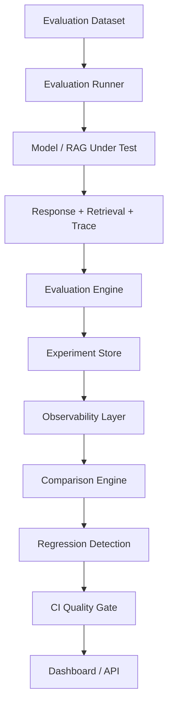

# LLM Evaluation & Observability Platform

A production-oriented platform for evaluating, comparing, tracing, and regression-testing LLM and RAG systems — built to answer the questions an AI engineering team actually asks: which model performs best, did this prompt change help or hurt, and is it safe to ship?

[](https://github.com/rajmyagentit-del/llm-eval-observability-platform/actions/workflows/ci.yml)
[](https://www.python.org/)
[](LICENSE)

**Status:** Early development (Phase 0 — project foundation). No public demo yet. This README is updated honestly as each phase is completed; nothing below is aspirational marketing copy.

## Problem

Shipping an LLM or RAG feature without a way to measure whether it's actually getting better — or quietly regressing — is common and expensive. Teams often rely on spot-checking outputs by eye, or nothing at all, until a bad model or prompt change reaches production.

## Why this matters

A serious AI engineering org needs the same discipline around model quality that it already applies to code: automated tests, regression detection, and a CI gate that can block a deploy. This project builds that discipline for LLM/RAG systems specifically as a reference architecture, not a toy chatbot demo.

## Planned architecture



This is the target design. Components are built incrementally, and this README is updated as each one becomes real and testable — nothing here is claimed as done until it has passing tests and, for user-facing pieces, a working demo.

## Key capabilities (planned)

- LLM evaluation: correctness, semantic similarity, relevance, completeness, hallucination indicators — deterministic where possible, LLM-as-judge as a supplement, not a dependency
- RAG evaluation: retrieval precision/recall, context precision/recall, groundedness, faithfulness
- Experiment tracking: every run's model, prompt version, parameters, dataset version, and metrics
- Observability: structured tracing across retrieval, prompt construction, inference, and evaluation, with latency percentiles (p50/p95/p99) and token/cost accounting
- Regression detection: baseline vs. candidate comparison with configurable pass/warning/fail thresholds
- CI/CD AI quality gate: GitHub Actions blocks a PR when evaluation quality regresses
- FastAPI service and a recruiter-facing interactive dashboard

## Current status

| Component | Status |
|---|---|
| Repository, devcontainer, Python packaging | Done |
| CI (lint + test on push/PR) | Done |
| Evaluation dataset & schemas | Not started |
| Model provider abstraction | Not started |
| Evaluation engine | Not started |
| RAG system + RAG evaluation | Not started |
| Experiment tracking | Not started |
| Observability/tracing | Not started |
| Regression detection | Not started |
| FastAPI service | Not started |
| Dashboard | Not started |
| Public live demo | Not started |

## Quick start (GitHub Codespaces — no local install required)

1. Open this repository on GitHub.
2. Click **Code -> Codespaces -> Create codespace on main**.
3. Wait for the devcontainer to build (Python 3.11 is pinned in `.devcontainer/devcontainer.json`; dependencies install automatically).
4. Run the test suite:

```bash
   pytest -v
```

No local Python, Docker, or IDE installation is required.

## Technical decisions

- **Python 3.11+, pinned via devcontainer** for a reproducible environment across contributors and CI.
- **`src/` layout with `pyproject.toml` (hatchling)**, the modern packaging standard, avoiding accidental imports from the working directory during tests.
- **pytest, ruff, and mypy** from day one rather than retrofitted later.
- Further decisions (evaluation methodology, provider abstraction, storage) are documented with reasoning as each is implemented.

## Testing

```bash
pytest -v
```

## CI/CD

Every push and pull request to `main` runs lint (`ruff check`) and the test suite via GitHub Actions (`.github/workflows/ci.yml`). This will be extended into an AI-specific quality gate — candidate model/prompt evaluated against a baseline, PR blocked on regression — in a later phase.

## Roadmap

1. Repository, Codespaces, CI, initial tests (this phase)
2. Evaluation dataset schemas
3. Model provider abstraction (mock + free/open-source)
4. Core evaluation engine
5. Experiment tracking
6. Reference RAG system
7. RAG evaluation
8. Observability and tracing
9. Model/prompt comparison
10. Regression detection
11. FastAPI service
12. Interactive dashboard
13. CI AI-quality gate
14. Containerization and reproducibility polish
15. Public deployment
16. Recruiter-facing polish and interview guide

## Limitations

This is a reference architecture built incrementally and documented honestly. Any claim of "production-proven" status or specific performance numbers will only appear once backed by actual runs of this system, with the environment, dataset, and configuration documented alongside them.

## License

MIT — see [LICENSE](LICENSE).
